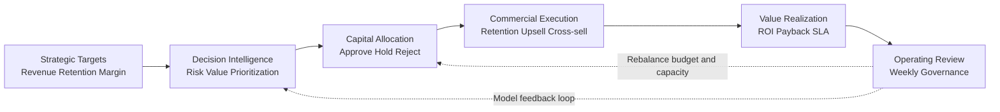
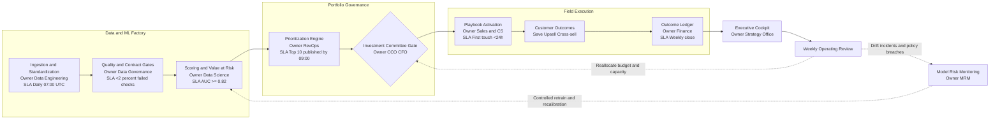

# Churn Prediction Pipeline (Enterprise)

[](./.github/workflows/ci.yml)
[](#setup)
[](https://data-senior-analytics.streamlit.app/)
[](https://github.com/samuelmaia-data-analyst/churn-prediction/releases/latest)

Idioma: **Português (PT-BR)** | [English](README.en.md)

Pipeline de analytics e ML com dataset Kaggle (Telco Customer Churn), estruturado em camadas:

- `raw -> bronze -> silver -> gold`
- modelo de `churn prediction`
- modelo de `next purchase prediction`
- reporting executivo para consumo de negócio
- orquestração com `Prefect`
- data quality checks com `Pandera`
- rastreabilidade de modelos com `MLflow`

## Contexto de Negócio

Este projeto simula uma operação de telecom ou assinatura com pressão para reduzir churn, proteger receita recorrente e melhorar a eficiência das ações de retenção.
O objetivo não é apenas prever cancelamento, mas transformar sinais de risco em priorização comercial, playbooks acionáveis e visibilidade executiva.

## Stakeholders

- Revenue Operations e CRM: definição da fila de atuação
- Customer Success e Retenção: execução de playbooks por segmento
- Marketing: leitura de valor por perfil e sensibilidade a oferta
- Finanças: proteção de receita e retorno sobre custo de ação
- Liderança executiva: visão consolidada de risco, impacto e capacidade operacional

## Release Oficial (Publica)
- Release publica com notas: https://github.com/samuelmaia-data-analyst/churn-prediction/releases/latest
- Notas locais da versao atual: [RELEASE_NOTES_v1.0.0.md](RELEASE_NOTES_v1.0.0.md)

## Business Outcome Simulation (Executive Snapshot)
Objetivo: transformar score tecnico em resultado financeiro defendivel para comite executivo.
Baseado em dados reais (Kaggle Telco Customer Churn) e premissas operacionais explicitas de adocao, custo e SLA.

- Valor protegido (carteira priorizada): `~$68k` por ciclo
- Impacto esperado liquido (cenario base): `+$16k` por ciclo apos custo de acao
- Cenario de adocao operacional: `70%` de cobertura do playbook com SLA de primeiro contato `<24h`
- Leitura executiva: capturar `~24%` do valor em risco ja cobre o custo operacional no cenario base

## Action Playbook (Resumo Executivo)
Tradução direta de risco + valor para acao comercial:

| Segment | Risk | Acao recomendada | Resultado esperado |
|---|---|---|---|
| High LTV | High | Contato humano de retencao em ate 24h | Maior valor protegido por cliente |
| Low LTV | High | Oferta de retencao por email | Controle de CAC com boa escala |
| High LTV | Medium | Outreach proativo de fidelizacao | Reducao de churn incremental |
| Low LTV | Medium | Jornada automatizada de nurture | Ganho eficiente de conversao |

## Pergunta de Negócio que o Projeto Responde

Quais clientes devem receber ação prioritária nesta semana, qual tipo de intervenção faz mais sentido por segmento e qual impacto financeiro esperado isso gera para a carteira?

## Sumário
- [Release Oficial (Publica)](#release-oficial-publica)
- [Business Outcome Simulation (Executive Snapshot)](#business-outcome-simulation-executive-snapshot)
- [Action Playbook (Resumo Executivo)](#action-playbook-resumo-executivo)
- [Destaques](#destaques)
- [Arquitetura](#arquitetura)
- [Streamlit (público)](#streamlit-publico)
- [Saídas de dados](#saidas-de-dados)
- [Setup](#setup)
- [Execução do pipeline](#execucao-do-pipeline)
- [Orquestração com Prefect](#orquestracao-com-prefect)
- [Qualidade](#qualidade)
- [Versionamento de artefatos](#versionamento-de-artefatos)
- [Dashboard Executivo Multipágina](#dashboard-executivo-multipagina)
- [Politica de Decisao por Custo](#politica-de-decisao-por-custo)
- [Action Playbook](#action-playbook)
- [Monitoramento de Drift](#monitoramento-de-drift)
- [Release](#release)
- [Dados](#dados)

## Destaques
- Arquitetura em camadas: `raw -> bronze -> silver -> gold`
- Star schema no gold (`fato + dimensões`)
- Predição de churn + predição de próxima compra
- Saídas executivas: `executive_report.json`, KPI CSV e priorização CSV
- Orquestração com `Prefect`
- Contratos de qualidade de dados com `Pandera`
- Rastreabilidade de modelos com `MLflow`
- Dashboard executivo multipágina em Streamlit

## Arquitetura
- Visão detalhada em [ARCHITECTURE.md](ARCHITECTURE.md)
- Organização por domínio com contratos em `src/contracts` e modelagem em `src/modeling`

## Modelagem de Churn

### 1) Baseline model
```
Baseline Model
Logistic Regression
ROC-AUC: 0.842
```

### 2) Comparação de modelos
Último run (`2026-03-05`) em `artifacts/reports/executive_report.json -> model_metrics.model_comparison`:

| Model | ROC-AUC |
|---|---:|
| Logistic | 0.842 |
| RandomForest | 0.818 |
| XGBoost* | 0.843 |
`*` fallback para `GradientBoosting` quando `xgboost` não está instalado.

### 3) Feature importance
Top drivers de churn para narrativa de negócio:

```
Top Drivers of Churn

- Contract type
- Tenure
- Monthly charges
```

### 4) Business insight
Insights executivos em `model_metrics.key_insights`:

```
Key Insights

Customers with month-to-month contracts
show 3x+ higher churn risk.
```
No último run, o valor observado foi `6.3x`.

### 5) Executive flowcharts (Mermaid)
Duas visoes complementares: `Board View` (sintese de decisao) e `Operator View` (execucao com owners e SLAs).

Board View:



Operator View:



## Streamlit (público)

https://data-senior-analytics.streamlit.app/

## Saídas de dados
- `data/bronze/customer_churn_bronze.csv`
- `data/silver/customer_churn_silver.csv`
- `data/gold/dim_customer.csv`
- `data/gold/dim_contract.csv`
- `data/gold/dim_service.csv`
- `data/gold/fact_customer_churn.csv`
- `artifacts/reports/executive_report.json`
- `artifacts/reports/model_card.md`
- `artifacts/reports/executive_brief.md`
- `artifacts/reports/action_playbook.md`
- `data/gold/kpi_summary.csv`
- `data/gold/customer_prioritization.csv`
- `data/gold/action_playbook.csv`
- `reports/drift_alert.json`

## Setup

```bash
python -m venv .venv
# Windows
.venv\Scripts\activate
pip install -r requirements.txt
```

## Execução do pipeline

```bash
python -m src.cli.pipeline --seed 42 --data-dir data --log-level INFO
```

## Orquestração com Prefect

Deploy configurado em [prefect.yaml](prefect.yaml) com agenda diária (`07:00 UTC`).

```bash
# 1) iniciar API local do Prefect (opcional, para UI local)
prefect server start

# 2) criar pool e iniciar worker
prefect work-pool create --type process default-agent-pool
prefect worker start --pool default-agent-pool

# 3) registrar deployment
prefect deploy --all

# 4) disparar execução manual
prefect deployment run "enterprise-churn-pipeline/daily-enterprise-run"
```

### Tracking de ML
- MLflow local em `./mlruns`
- modelos versionados por execução no run do pipeline

### Logging estruturado
- logs JSON em `artifacts/logs/pipeline.log`
- cada execução tem `run_id`

## Qualidade

- `pre-commit` com `black`, `ruff`, `isort`
- `pytest` para contratos do pipeline e outputs
- CI executando:
  - `ruff check app.py api.py main.py predict_customer.py save_processed_data.py apps src tests pages`
  - `black --check app.py api.py main.py predict_customer.py save_processed_data.py apps src tests pages`
  - `pytest -q`

## Versionamento de artefatos
- `artifacts/` e `mlruns/` não devem ser enviados para o Git.
- versione apenas código, configurações e documentação.

## Dashboard Executivo Multipágina
- `Executive Overview`
- `Risk and Growth`
- `Prioritization`
- `Simulation`

Com download direto de:
- `executive_report.json`
- `customer_prioritization.csv`

Comportamento de bootstrap do dashboard:
- se `artifacts/reports/` e `data/gold/` não existirem e houver `data/raw`, o app gera os artefatos via pipeline real;
- se o pipeline falhar ou não houver `data/raw`, o app gera fallback sintético para não ficar vazio.

## Politica de Decisao por Custo

Regra de threshold orientada por custo de erro:

`threshold = Custo_FP / (Custo_FP + Custo_FN)`

- baseline global (`balanceada`): `threshold = 0.50`
- estrategia sensivel a valor (aplicada em producao):
  - `High LTV`: `threshold = 0.65`
  - `Low LTV`: `threshold = 0.80`

Leitura executiva:
- clientes `High LTV` entram em acao mais cedo para maximizar retencao de valor;
- clientes `Low LTV` usam corte mais conservador para controlar custo de campanha.

## Action Playbook

Tabela acionavel por segmento de valor e risco:

| Segment | Risk | Action | Expected ROI |
|---|---|---|---|
| High LTV | High | Call retention | +$200/customer |
| Low LTV | High | Retention offer by email | +$90/customer |
| High LTV | Medium | Proactive loyalty outreach | +$80/customer |
| Low LTV | Medium | Automated nurture journey | +$35/customer |

Saidas:
- `data/gold/action_playbook.csv`
- `artifacts/reports/action_playbook.md`

## Monitoramento de Drift

Monitoramento mínimo em runtime com:
- `PSI` (Population Stability Index)
- `KS` (Kolmogorov-Smirnov)

Thresholds de alerta:
- `PSI >= 0.20`
- `KS >= 0.15`

Arquivo de alerta gerado a cada execução:
- `reports/drift_alert.json`

Baseline de referência:
- `reports/drift_reference.csv` (criado automaticamente no primeiro run)

Script standalone:
- `monitoring/drift_detection.py`

Execucao:

```bash
python monitoring/drift_detection.py --baseline reports/drift_reference.csv --current data/gold/customer_prioritization.csv --output reports/drift_alert.json
```

## Release

- Versao: `v1.0.0`
- Versionamento de modelo:
  - `models/model_v1.pkl`
  - `models/model_metadata.json`

## Dados

Dataset utilizado: Kaggle - Telco Customer Churn  
Fonte oficial: https://www.kaggle.com/datasets/blastchar/telco-customer-churn  
Arquivo esperado em: `data/raw/WA_Fn-UseC_-Telco-Customer-Churn.csv`
