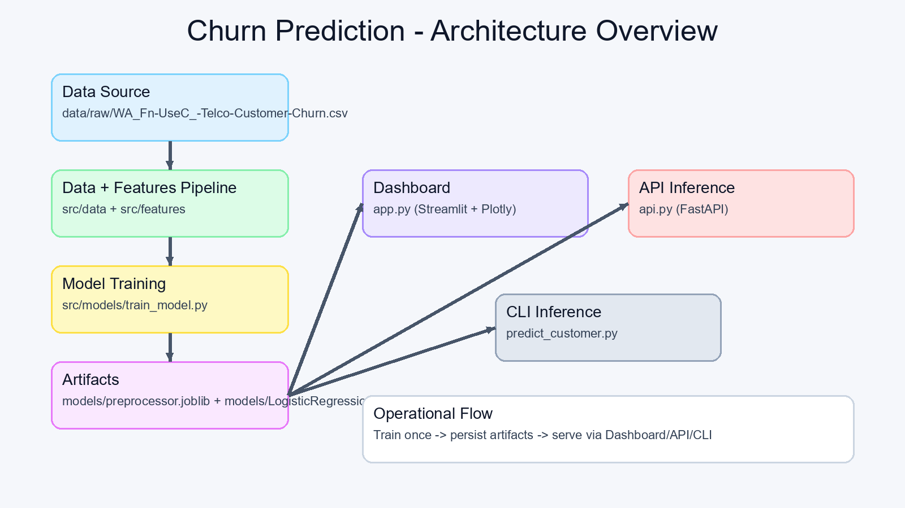
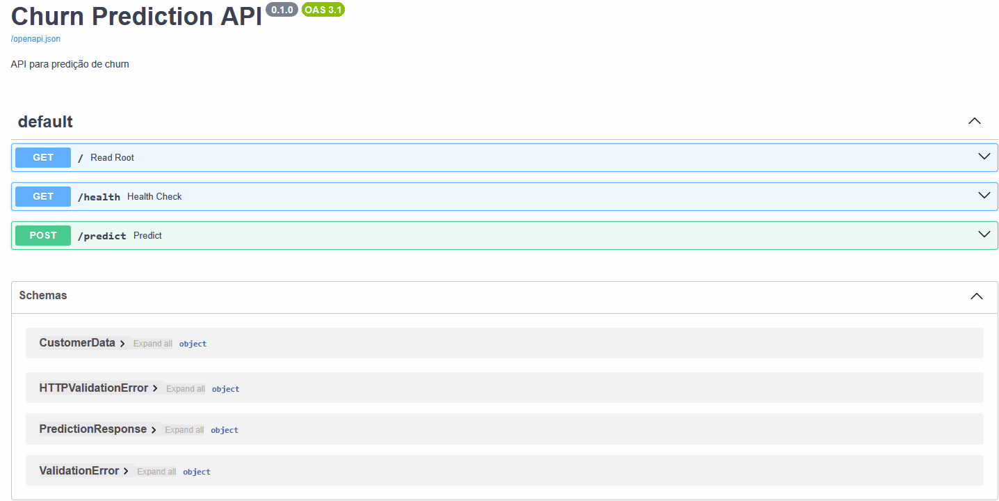

# Plataforma de Predição de Churn

[](#roadmap)
[](#stack-tecnológica)
[](#performance-do-modelo)
[](#contrato-da-api)
[](#demonstração)

Idioma: **PT-BR** | [English](README.en.md)

Projeto de previsão de churn com pipeline de Machine Learning, API FastAPI e dashboard Streamlit para apoiar decisões de retenção de clientes.

## Resumo Executivo

- Solução end-to-end de **Customer Churn Prediction** com Python e scikit-learn.
- Camada de inferência deployável com **FastAPI** e análise visual com **Streamlit + Plotly**.
- Pipeline de pré-processamento persistido para inferência consistente entre treino e produção.
- Modelo salvo atual com alta capacidade de ranking (**ROC-AUC 0.8420**).

## Contexto de Negócio

### Problema
Empresas com receita recorrente perdem margem quando o churn é identificado tardiamente.

### Solução
Pipeline supervisionado de classificação binária para estimar probabilidade de churn por cliente, com exposição via API e dashboard.

### Resultado Esperado
Permite priorizar clientes de alto risco, otimizar budget de retenção e proteger receita.

## Resultados-Chave

| Métrica | Valor |
|---|---:|
| Accuracy | 0.8055 |
| Precision | 0.6572 |
| Recall | 0.5588 |
| F1-score | 0.6040 |
| ROC-AUC | 0.8420 |

Artefato principal: `models/LogisticRegression.joblib`

## Arquitetura da Solução



```text
Dados CSV
  -> Limpeza e split
  -> Engenharia de features + pré-processamento
  -> Treino e seleção do modelo
  -> Persistência de artefatos (modelo + preprocessor)
  -> Consumo via API / Dashboard / CLI
```

## Stack Tecnológica

- **Linguagem:** Python
- **Dados e ML:** pandas, numpy, scikit-learn
- **Persistência:** joblib
- **API:** FastAPI, Pydantic, Uvicorn
- **Dashboard:** Streamlit, Plotly

## Funcionalidades

- Pipeline completo de modelagem de churn.
- Dashboard interativo com filtros e predição individual.
- Endpoint REST para scoring em tempo real.
- Reuso do mesmo preprocessor no app e na API (evita train-serving skew).

## Demonstração

| API Demo | Dashboard Demo |
|---|---|
|  |  |

## Contrato da API

### Health
- `GET /health`

### Predição
- `POST /predict`

Exemplo de request:

```json
{
  "gender": "Male",
  "SeniorCitizen": 0,
  "Partner": "Yes",
  "Dependents": "No",
  "tenure": 12,
  "PhoneService": "Yes",
  "MultipleLines": "No",
  "InternetService": "Fiber optic",
  "OnlineSecurity": "No",
  "OnlineBackup": "Yes",
  "DeviceProtection": "No",
  "TechSupport": "No",
  "StreamingTV": "No",
  "StreamingMovies": "No",
  "Contract": "Month-to-month",
  "PaperlessBilling": "Yes",
  "PaymentMethod": "Electronic check",
  "MonthlyCharges": 65.5,
  "TotalCharges": 786.0
}
```

Exemplo de response (implementação atual):

```json
{
  "churn": "Sim",
  "probability": 0.73,
  "risk_level": "Alto"
}
```

## Setup Rápido

```bash
git clone <url-do-repositorio>
cd churn-prediction
python -m venv .venv
# Windows: .venv\Scripts\activate
# Linux/macOS: source .venv/bin/activate
pip install -r requirements.txt
python main.py
uvicorn api:app --reload
# em outro terminal: streamlit run app.py
```

## Estrutura do Repositório

```text
churn-prediction/
|-- app.py
|-- api.py
|-- main.py
|-- predict_customer.py
|-- config.yaml
|-- requirements.txt
|-- data/
|-- models/
|-- src/
|   |-- data/
|   |-- features/
|   `-- models/
|-- tests/
`-- assets/
```

## Decisões de Engenharia

- Seleção de modelo por **F1-score** para balancear precision e recall.
- Persistência de `preprocessor.joblib` para consistência de features.
- API e dashboard desacoplados, consumindo os mesmos artefatos.

## Qualidade e Testes

Estado atual:
- estrutura de testes existe em `tests/`, mas suites ainda não implementadas.

Próximos passos:
- testes unitários de pré-processamento;
- testes de contrato da API;
- validação de schema de entrada do modelo.

## Roadmap

- Cobertura automatizada de testes (unit + integration).
- Rastreabilidade de experimentos e métricas.
- Monitoramento de drift de dados/modelo.
- Batch scoring na API.
- CI/CD para validação e release.

## Palavras-chave ATS

`Python` `Machine Learning` `Churn Prediction` `scikit-learn` `FastAPI` `Streamlit` `Model Deployment` `REST API` `Data Science` `MLOps` `Feature Engineering` `Binary Classification` `Model Evaluation` `ROC-AUC`

## Contato

**Samuel de Andrade Maia**
- GitHub: https://github.com/samuelmaia-data-analyst
- LinkedIn: https://linkedin.com/in/samuelmaia-data-analyst

## Licença

Licença ainda não definida. Recomendado: MIT.
