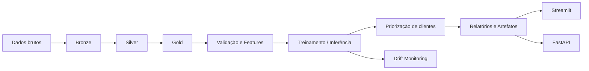

# Churn Prediction Data Product

**Projeto de Data Analytics, Machine Learning e Analytics Engineering para priorização de clientes com risco de churn.**

[](https://www.python.org/)
[](app.py)
[](apps/)
[](.github/workflows)

**Idioma:** `Português (principal)` | [English](README.en.md) se disponível | [PT-BR](README.pt-BR.md)

> Fluxo principal: dados brutos → bronze → silver → gold → treinamento/inferência → priorização → dashboard/API.

---

## O que este projeto resolve

O projeto transforma um problema clássico de churn em um **produto de dados completo**, indo além do treinamento de um modelo. A solução organiza dados em camadas, valida contratos, treina e aplica modelos de Machine Learning, gera artefatos reutilizáveis e disponibiliza os resultados para consumo por dashboard e API.

O foco é responder perguntas de negócio como:

- quais clientes apresentam maior risco de churn;
- quais clientes devem ser priorizados primeiro;
- como o limiar de decisão muda conforme o custo da campanha;
- quais artefatos ajudam as áreas de retenção a transformar score em ação.

> Projeto de portfólio construído com dados públicos de demonstração. Os benefícios descritos representam o valor que a solução foi projetada para gerar e não resultados de uma empresa real.

---

## Principais entregas

- Pipeline de dados com camadas **Raw, Bronze, Silver e Gold**.
- Validação de schema e contratos antes do treinamento.
- Preparação de features e treinamento de modelos com `scikit-learn`.
- Inferência e geração de lista priorizada de clientes.
- Simulação de políticas e limiares de decisão para campanhas de retenção.
- Dashboard Streamlit para análise executiva, risco e priorização.
- API FastAPI para disponibilização dos resultados do modelo.
- Monitoramento de drift utilizando PSI e KS.
- Geração de artefatos de EDA, model card, relatórios e metadados de execução.
- Saída pseudonimizada orientada à privacidade para consumo analítico.
- Testes automatizados, lint, type checking e CI com GitHub Actions.

---

## Impacto demonstrado

A arquitetura foi desenvolvida para:

- transformar scores de churn em uma lista acionável de prioridades;
- melhorar a rastreabilidade entre dados, modelo e decisão;
- reduzir dependência de notebooks e processos manuais;
- permitir reexecução reproduzível do pipeline;
- apoiar decisões de retenção considerando risco, prioridade e custo de campanha;
- aumentar a confiabilidade dos resultados com validações, testes e artefatos persistidos.

---

## Arquitetura


```mermaid
flowchart LR
    A[Dados brutos] --> B[Bronze]
    B --> C[Silver]
    C --> D[Gold]
    D --> E[Validação e Features]
    E --> F[Treinamento / Inferência]
    F --> G[Priorização de clientes]
    G --> H[Relatórios e Artefatos]
    H --> I[Streamlit]
    H --> J[FastAPI]
    F --> K[Drift Monitoring]
```

### Estrutura principal

| Camada | Responsabilidade |
|---|---|
| `src/runtime/` | Configuração, ambiente e logging |
| `src/pipelines/` | Ingestão, transformação, validação, monitoramento e reporting |
| `src/modeling/` | Treinamento, inferência e contratos do preditor |
| `analytics_dbt/` | Camada analítica opcional com dbt |
| `apps/` | Dashboard, API e componentes de consumo |
| `artifacts/` | Metadados e artefatos gerados |
| `data/` | Camadas Raw, Bronze, Silver e Gold |
| `tests/` | Testes automatizados |

Documentação completa: [docs/ARCHITECTURE.md](docs/ARCHITECTURE.md)

---

## Tecnologias

**Dados e processamento**  
Python · Pandas · NumPy · dbt

**Machine Learning**  
scikit-learn · MLflow (opcional)

**Qualidade e contratos**  
Pandera · Pytest · Ruff · Black · Isort · MyPy · Pre-commit

**Consumo**  
Streamlit · FastAPI

**Engenharia e CI/CD**  
GitHub Actions · logging estruturado · artefatos persistidos · Docker Compose

---

## Consumo analítico

A aplicação foi estruturada para não depender de estado de notebook. Dashboard e API consomem artefatos persistidos pelo pipeline.

Principais superfícies:

- `app.py` — entrada principal do Streamlit;
- `apps/streamlit_app.py` — control room e scoring por cliente;
- `apps/pages/` — páginas executivas, risco, priorização e simulação;
- FastAPI — superfície de inferência e integração.

---

## Confiabilidade e governança

O projeto implementa controles proporcionais ao escopo do portfólio:

- configuração via `.env` e variáveis de ambiente;
- logging estruturado com `run_id`;
- metadados de execução persistidos;
- manifesto de lineage por execução;
- manifesto de governança;
- persistência atômica de CSV, JSON e Markdown;
- validação de schema antes do treinamento;
- retry controlado no pipeline;
- monitoramento de drift por PSI e KS;
- sinalização explícita de fallback no dashboard;
- saída pseudonimizada orientada à LGPD.

---

## Como revisar este projeto em 5 minutos

1. Leia **O que este projeto resolve** e **Principais entregas**.
2. Confira a arquitetura acima.
3. Abra `apps/pages/` para entender as visões executivas e de priorização.
4. Leia [docs/DASHBOARD.md](docs/DASHBOARD.md) e [docs/GOVERNANCE.md](docs/GOVERNANCE.md).
5. Execute os testes para validar os quality gates.

---

## Execução local

### 1. Criar ambiente

```bash
python -m venv .venv
.venv\Scripts\python.exe -m pip install --upgrade pip
.venv\Scripts\python.exe -m pip install -r requirements-runtime.txt
.venv\Scripts\python.exe -m pip install -r requirements-dev.txt
copy .env.example .env
```

### 2. Dataset

Arquivo esperado:

`data/raw/WA_Fn-UseC_-Telco-Customer-Churn.csv`

Fonte utilizada no projeto: Kaggle — `blastchar/telco-customer-churn`.

### 3. Executar pipeline

```bash
.venv\Scripts\python.exe -m src.cli.pipeline --data-dir data --log-level INFO --decision-policy balanceada --environment dev
```

### 4. Validar qualidade

```bash
make test
make lint
make typecheck
```

---

## Limitações e decisões de escopo

O projeto é production-minded, mas não se apresenta como uma plataforma corporativa em produção.

Principais escolhas de escopo:

- armazenamento local em vez de storage remoto;
- observabilidade de drift leve em vez de uma stack completa de monitoring;
- orquestração opcional, não obrigatória;
- wrappers de compatibilidade preservados para não quebrar entrypoints antigos.

---

## Documentação

- [docs/README.md](docs/README.md)
- [docs/ARCHITECTURE.md](docs/ARCHITECTURE.md)
- [docs/DASHBOARD.md](docs/DASHBOARD.md)
- [docs/OPERATIONS.md](docs/OPERATIONS.md)
- [docs/ANALYTICS_ENGINEERING.md](docs/ANALYTICS_ENGINEERING.md)
- [docs/GOVERNANCE.md](docs/GOVERNANCE.md)
- [docs/REPOSITORY_STRUCTURE.md](docs/REPOSITORY_STRUCTURE.md)

---

## Elemento visual

Ainda não há GIF ou screenshot principal versionado no repositório. Quando esse material estiver pronto, a recomendação é posicioná-lo próximo ao início do README, antes da seção de arquitetura, para facilitar a compreensão por recrutadores não técnicos.

---

## Licença

Este trabalho está licenciado sob **Creative Commons Attribution-NonCommercial 4.0 International (CC BY-NC 4.0)**.

[](https://creativecommons.org/licenses/by-nc/4.0/)
